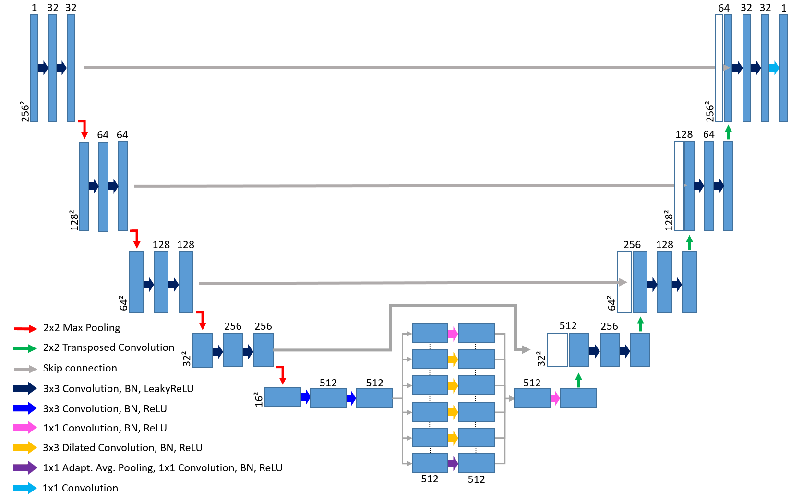
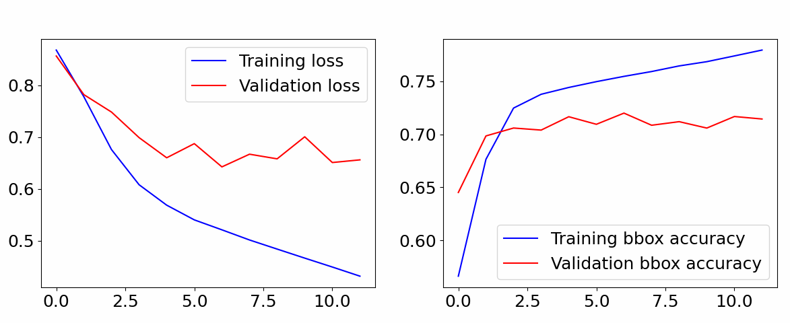
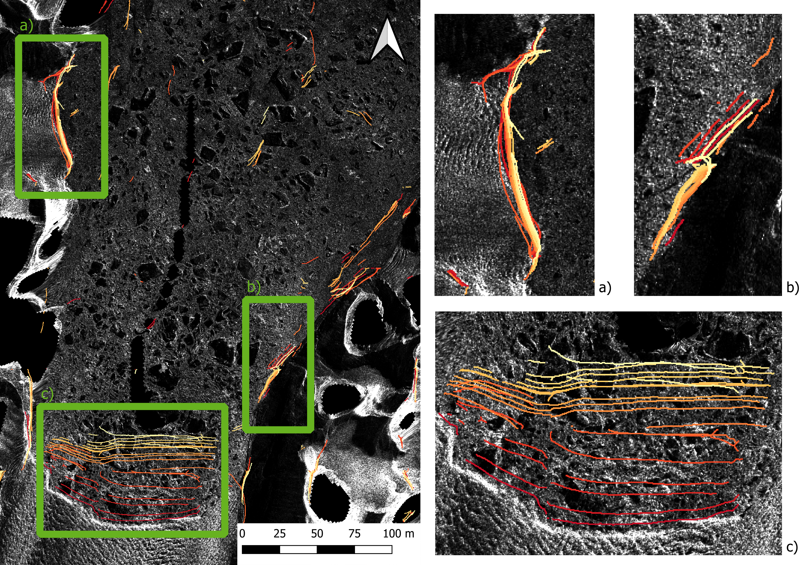

## 1. Introduction: Glacier Deep Learning

Welcome to the GlacierDL Git of the [EAGLE](https://eagle-science.org/) course **Advanced Programming for Remote Sensing
and GIS (04-GEO-MET4)**. Here, we reimplemented a neural network in [PyTorch](https://pytorch.org/) capable of learning
and predicting glacier calving fronts. The architecture and main processing steps were proposed earlier by **Gourmelon**
et al. (CAlving Fronts and where to Find thEm: a benchmark dataset and methodology for automatic glacier calving front
extraction from sar imagery). Furthermore, we make use of the
[CaFFe](https://download.pangaea.de/dataset/940950/files/data_raw.zip) dataset to train, validate and predict one
timeseries of the [Crane](https://en.wikipedia.org/wiki/Crane_Glacier) Glacier located in Antarctica.

## 2. Background

Glaciers, ice sheets, and ice caps are increasingly losing mass due to a changing climate. Unlike land-terminating
glaciers, marine-terminating or tidewater glaciers are defined as ice masses that reach the ocean along a grounded
terminus, floating terminus, or ice shelf. While all glaciers contribute to sea level rise through surface melt,
marine-terminating glaciers also contribute via frontal ablation or the calving of icebergs.  
Monitoring the transformation of the calving fronts provides an essential climate variable and important information to
better understand glacier mass balance, natural hazards, ice-ocean interactions, and the impact of climate change.
The delineation of these fronts is an important part of the satellite-based monitoring process and is usually carried
out by manual mapping (Kochtitzky und Copland 2022). Especially in polar regions, calving front delineation can be a
difficult task because the ocean downstream of the glacier is often covered with sea ice as well as calved off icebergs,
the so-called ice mélange. Until now, only a small number of studies applied automatic or semi-automatic approaches even
though deep learning techniques have shown high potential for carrying out such complex segmentation tasks, e.g., for
medical imagery. Most of the methods applied in recent years used optical imagery, which has the drawback of being
dependent on daytime, cloud-free conditions (Gourmelon et al. 2022; Herrmann et al. 2023). Therefore, detecting calving
fronts based on SAR images is highly desirable since it has the advantages of acquisitions during polar night and
independence of weather conditions (e.g. cloud cover), which allows for year-round monitoring worldwide.

## 3. Dataset

The benchmark dataset published by Gourmelon et al. 2022 provides 681 SAR images of calving fronts from multiple
glaciers located in Antarctica, Greenland, and Alaska. For every SAR image, two sets of labels are provided: one
binary segmentation label to discern the calving front (one-pixel wide line) from the background, and one label for
multi-class segmentation of different landscape classes. The classes include: ocean, glacier, rock, and no information
available (e.g. radar shadow and layover areas, areas outside the swath) (Herrmann et al. 2023).

## 4. Architecture and Implementation Details

For detecting the calving fronts we employ a manipulated Unet architecture. First, we half the image channels in each
depth in contrast to the original model by **Ronneberger et al. (2017)**. Secondly, the bottleneck is extended with an
***Atrous Spatial Pyramid Pooling*** module proposed by **Chen et al.** in 2016, which help conver more global context
in deeper feature spaces. The architecture reads as presented in the following figure: 
\
\

\
\
We train this architecture on a 20GB partition of one 80GB NVIDIA A100 GPU cluster setup. Within our implementation,
we go with an Adam optimizer, Dice-Score as a loss function and a batch size of 16. The learning rate we chose for a
detailed train-out 1e-04. For investigating on the desired learning rate (and batch size), we use PyTorch Ray Train and
created 200 training variations with different hyperparameter settings from a learning rate from 1e-02 to 1e-07 and
batch sizes from 2 to 32. After finding the best rough setting out of this, we set specific values to have a full
training and save every epoch. For this, we use an early stopping approach based on the validation loss with a patience
parameter of 5.
\
\
To further validate our model, we employ an accuracy metric. However, calculating the accuracy over the whole image
would yield high values from the beginning on due to a high class imbalance. Therefore, we only calculate the accuracy
in the bounding bx the front line we want to predict.

## 5. Results
Overall, our model shows solid performance. However, metrics fluctuate heavy in some parts due to the lack of data. As
for numerical results, wee achieve a bounding box accuracy of roughly 70%. We present our loss curve and the bounding 
box accuracy in the following figure:
\
\

\
\
For the visual results, we created a time series on the Crane Glacier located in Antarctica. Here, we want to stress, 
that our model converges very strongly, as we only trained and validated on completely other glaciers and not included
this particular form of front in our training / validation data. From the following figure, we can conclude not some 
movement in the glacier ice to stone edges (a and b), but a clear directional development on the glacier ice to water front.
The picture was made our of 18 observations from June 2011 to November 2012.
\
\

\
\
Greetings,

[Sarah Leibrock](https://github.com/leibrocs) and [Konstantin "Caipi" Müller](https://konstide.github.io/)

## References

Gourmelon, Nora; Seehaus, Thorsten; Braun, Matthias; Maier, Andreas; Christlein, Vincent (2022):
Calving fronts and where to find them: a benchmark dataset and methodology for automatic glacier calving front
extraction from synthetic aperture radar imagery. In: Earth Syst. Sci. Data 14 (9),
S. 4287–4313. DOI: 10.5194/essd-14-4287-2022.
\
\
Herrmann, Oskar; Gourmelon, Nora; Seehaus, Thorsten; Maier, Andreas; Fürst, Johannes; Braun, Matthias Holger;
Christlein, Vincent (2023): Out-of-the-box calving front detection method using deep-learning.
\
\
Kochtitzky, William; Copland, Luke (2022): Retreat of Northern Hemisphere Marine‐Terminating Glaciers, 2000–2020. In:
Geophysical Research Letters 49 (3). DOI: 10.1029/2021GL096501.
